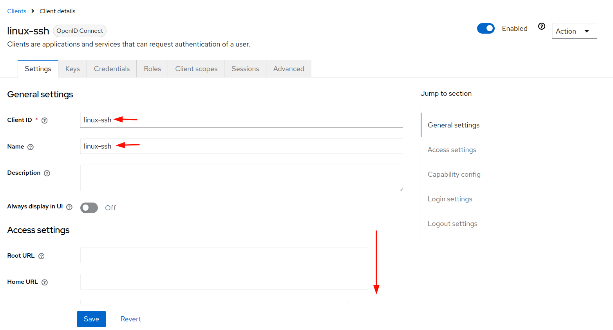
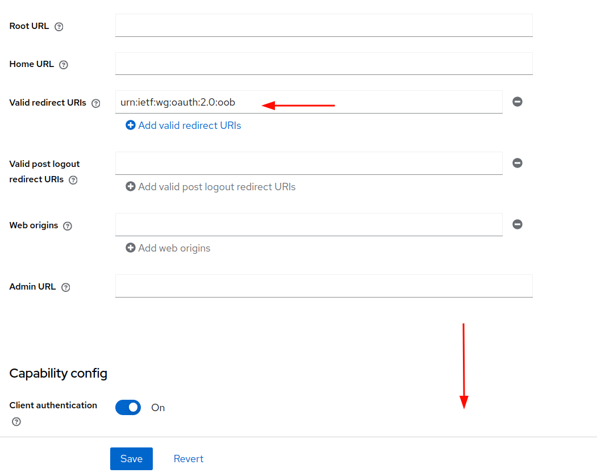
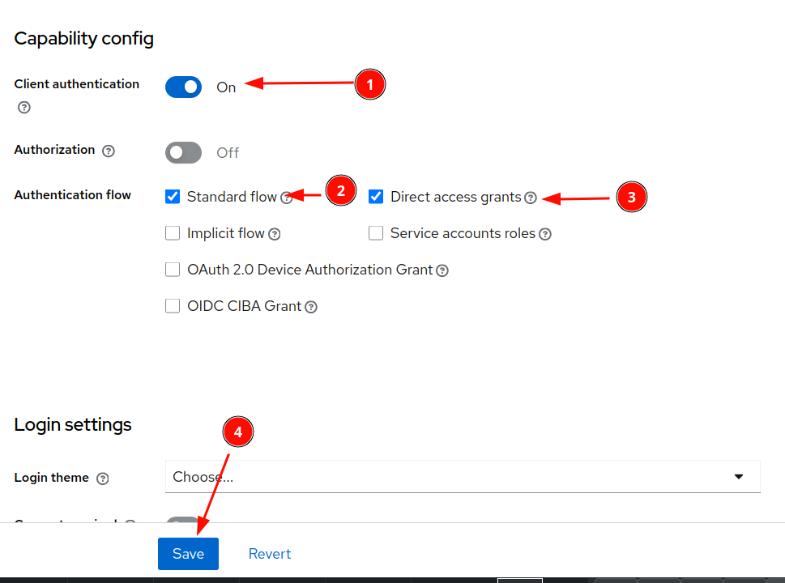

# TODO:
* Better way to get the output.zip


If the user logs in via scp (in the moment on port 993, please don't forget to allow port 993 via ufw allow 993), a package list with the HajTex documents for that user is generated. ssh is blocked. 

Every 5 minutes, the user data base of HajTex is checked and new user in the database are created. 

If a user logs in, the system builds / updates git repos of the user's projects. 

Get the ssh keys:

```
git clone ssh://davrot@uni-bremen.de@psintern.neuro.uni-bremen.de:993/sshkey
```

Get the project 6759fdf66ca7b8bc5b81b184 :

```
git clone ssh://davrot@uni-bremen.de@psintern.neuro.uni-bremen.de:993/6759fdf66ca7b8bc5b81b184
```


If you don't like Keycloak authentification (e.g. want to change to a LDAP server), you need to work on the first line of /files/pam_sshd

```
auth sufficient pam_exec.so expose_authtok log=/var/log/kc-ssh-pam.log /process_user_auth.sh
```

Don't forget the crontab entry for host:

```
# m h  dom mon dow   command
*/5 * * * * sh /docker/compose/hajtex_sshd/exec_update_userlist.sh
```

Otherwise, login will fail without the user directories. You can also run it manually:
```
sh /docker/compose/hajtex_sshd/exec_update_userlist.sh
```


# ssh / scp / git-shell authentification against KeyCloak

## Create the client in keycloak:

```
urn:ietf:wg:oauth:2.0:oob
```



---



---



---


## Update config.yaml

```
clientsecret = "REDACTED"
```

## Create image:

```
>> make_image.sh
```

## Make automation@non.no an HajTex admin

First login once in HajTex with this user then we elevate the user to admin status:

```
>> cd /docker/compose/check_users
>> sh exec_make_admin.sh automation@non.no
```

Udpate config.json
```
"admin_password": "REDACTED",
```
with the password of the automation@non.no user.
